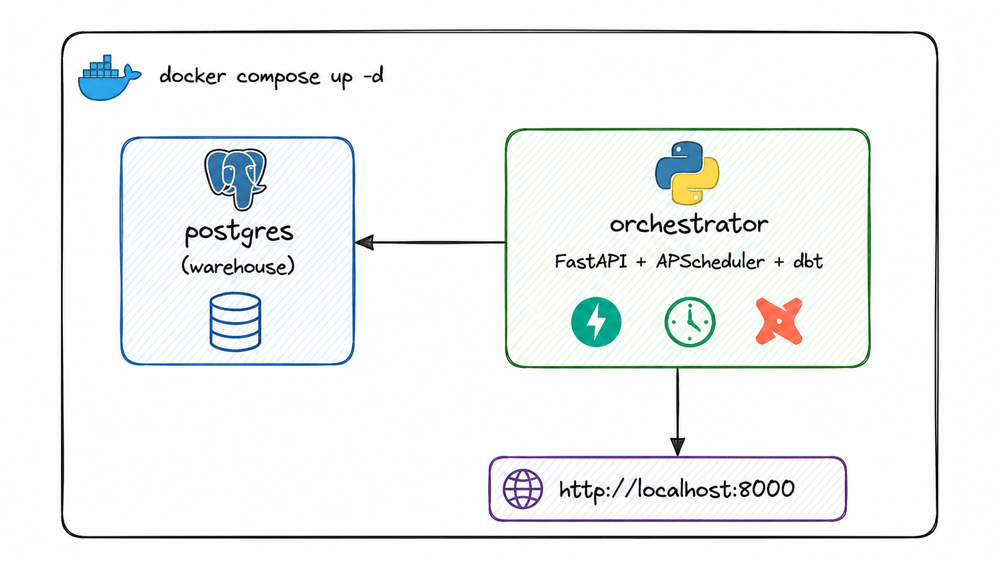

# postgres_dbt

Projeto de analytics com **dbt + Postgres** acompanhado de um **orquestrador web** (FastAPI + APScheduler) com interface Bootstrap para agendar e monitorar execuções do dbt — tudo containerizado.



---

## Estrutura

```text
postgres_dbt/
├── dbt_project.yml          # projeto dbt
├── profiles.yml             # conexão com Postgres (lê env vars)
├── packages.yml             # dbt_utils, dbt_expectations
├── models/
│   ├── staging/             # views 1:1 com sources
│   └── marts/core/          # dim_customers, fct_orders
├── snapshots/               # SCD type 2 do churn
├── seeds/                   # CSVs (raw schema)
├── macros/
├── docker/
│   └── Dockerfile.orchestrator
├── docker-compose.yml
├── .env.example
└── orchestrator/            # app web (FastAPI + Jinja + HTMX)
    ├── requirements.txt
    └── app/
        ├── main.py
        ├── scheduler.py
        ├── runner.py
        ├── routes/
        └── templates/
```

---

## Pré-requisitos

- Docker + Docker Compose
- (Opcional) `make`, Python 3.12 para rodar fora do container

---

## Setup rápido

```bash
cp .env.example .env
# edite POSTGRES_PASSWORD em .env

docker compose up -d --build
```

A UI fica em <http://localhost:8000>. A API REST e os docs OpenAPI em `/docs`.

### Primeira carga

Depois de subir o stack, crie um agendamento no UI **ou** rode manualmente:

```bash
docker compose exec orchestrator dbt deps   --project-dir /dbt
docker compose exec orchestrator dbt seed   --project-dir /dbt
docker compose exec orchestrator dbt build  --project-dir /dbt
```

---

## Usando o orquestrador

1. Acesse `http://localhost:8000`.
2. **Novo Agendamento** → preencha:
   - **Nome**: identificador legível.
   - **Comando**: `seed`, `run`, `test`, `build`, `snapshot`, `source freshness`, `compile`, `deps`.
   - **Seletor** (opcional): ex.: `--select tag:staging`, `--select state:modified+`.
   - **Cron**: ex.: `0 2 * * *` (todo dia 02:00).
3. Use **▶ Executar agora** para disparo ad-hoc.
4. **Execuções → ver** abre o log streaming via HTMX (auto-refresh a cada 2s enquanto rodando).

---

## Convenções dbt

| Camada          | Materialização       | Schema         |
| --------------- | -------------------- | -------------- |
| `staging/`      | view                 | `staging`      |
| `intermediate/` | ephemeral            | `intermediate` |
| `marts/`        | table (com índices)  | `marts`        |

- Modelos staging: padrão `stg_<source>__<table>.sql`.
- Cada modelo tem `unique`/`not_null` em PKs e `relationships` em FKs.
- Sources declaram `freshness` quando aplicável.
- Em **dev**, schemas customizados são prefixados pelo schema do target (isolamento por dev). Em **prod**, são literais — comportamento controlado por `macros/generate_schema_name.sql`.

---

## Comandos úteis

```bash
docker compose logs -f orchestrator     # ver logs do app
docker compose exec orchestrator bash   # shell no container
docker compose exec postgres psql -U dbt analytics   # psql no warehouse
docker compose down                      # parar (mantém volumes)
docker compose down -v                   # parar e apagar dados
```

---

## Variáveis de ambiente (`.env`)

| Variável            | Default               | Descrição                              |
| ------------------- | --------------------- | -------------------------------------- |
| `POSTGRES_USER`     | `dbt`                 | usuário do warehouse                   |
| `POSTGRES_PASSWORD` | —                     | senha do warehouse (**defina!**)       |
| `POSTGRES_DB`       | `analytics`           | banco do warehouse                     |
| `DBT_PG_SCHEMA`     | `dev`                 | schema default do target               |
| `DBT_TARGET`        | `dev`                 | `dev` ou `prod` (do `profiles.yml`)    |
| `TZ`                | `America/Sao_Paulo`   | fuso usado pelo APScheduler            |

---
